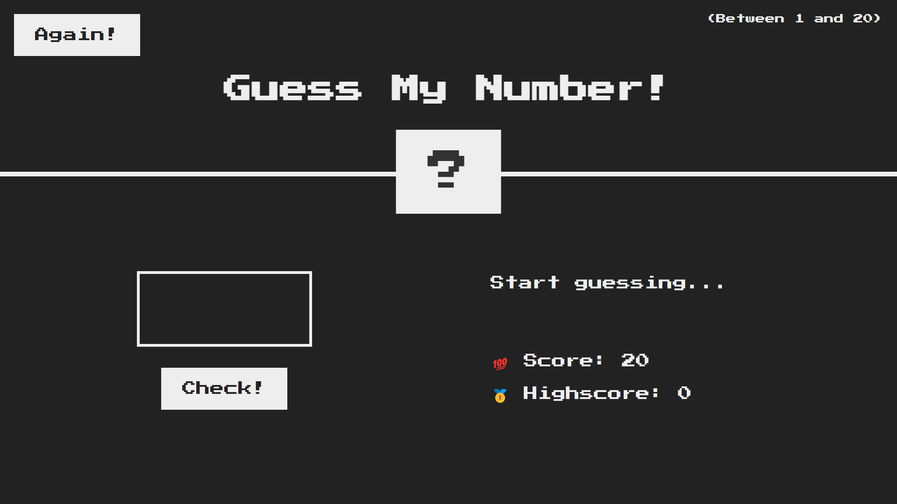
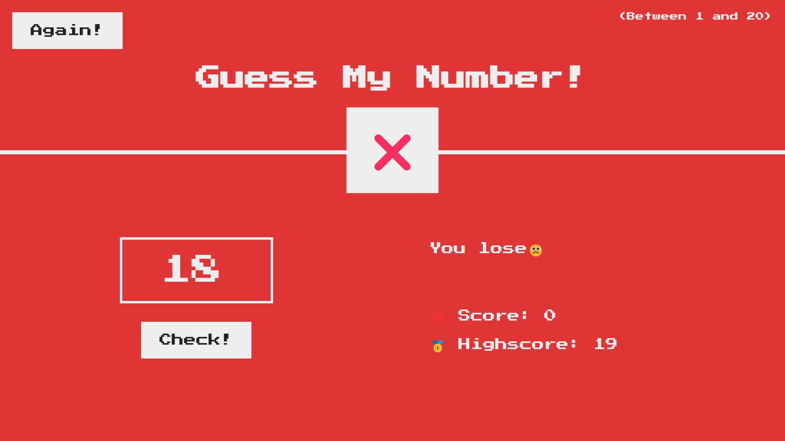
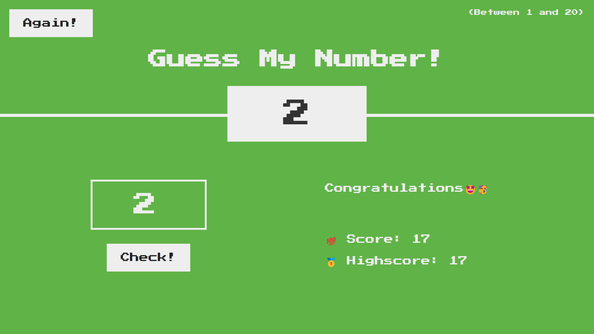
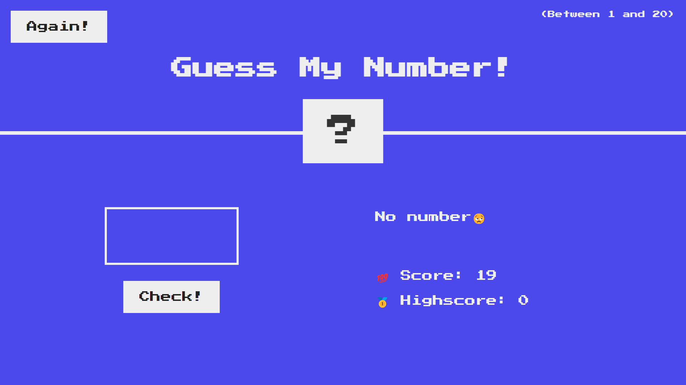
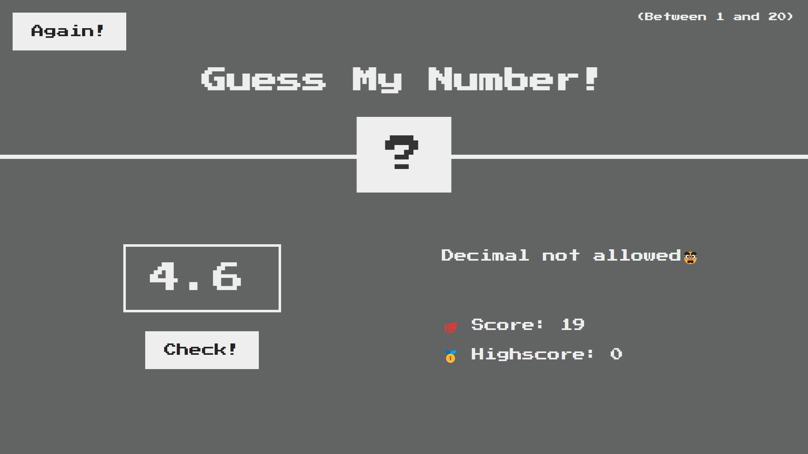
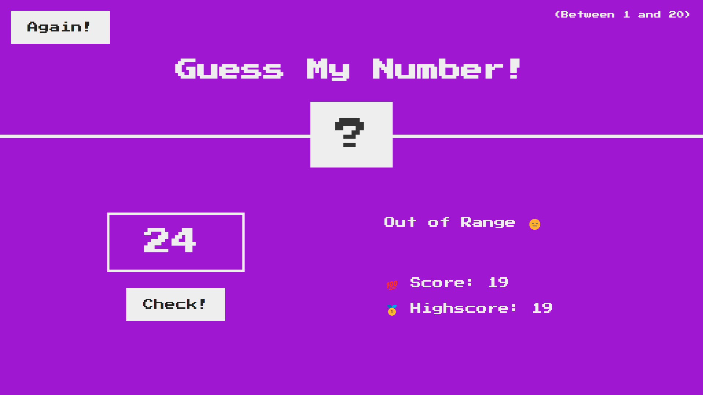

# Guess My Number

Hello Everyone 😊

This is a basic gaming project build on the foundation of **HTML**, **CSS**, **JavaScript**(beginner level project).
This project is part of my JavaScript learning course, I am very much grateful to [Jonas Schmedtmann](https://www.udemy.com/user/jonasschmedtmann/) for his style of teaching, you can also avail the [course](https://www.udemy.com/course/the-complete-javascript-course/).

I have implemented his idea but modified the code to different level(soon you will find out).
** *********************************************************************** **
About the game: When you load this in the browser, which will look like this -

<picture >
  

</picture>

A random number gets generated between 1 to 20, the user has to enter a number between 1 to 20. The score is set to 20 in the beginning, after each attempt the score reduces by 1, if the user loses all his 20 attempts then he lost the game

<picture >
  

</picture>

or the user guess the correct random number.

<picture >
  

</picture>

This was a basic walkthorugh, there is an example below, now let's see the condtions

> ### **Condtion:**

>  Condition 1: If Guess value is  null, then it will thrown an error
<picture >
  

</picture>

> Condition 2: If Guess value is not integer, then it will thrown an error 
<picture >
  

</picture>

> Condition 3: If Guess value is not in the given range(between 1 to 20), then it will thrown an error 
<picture >
  

</picture>

