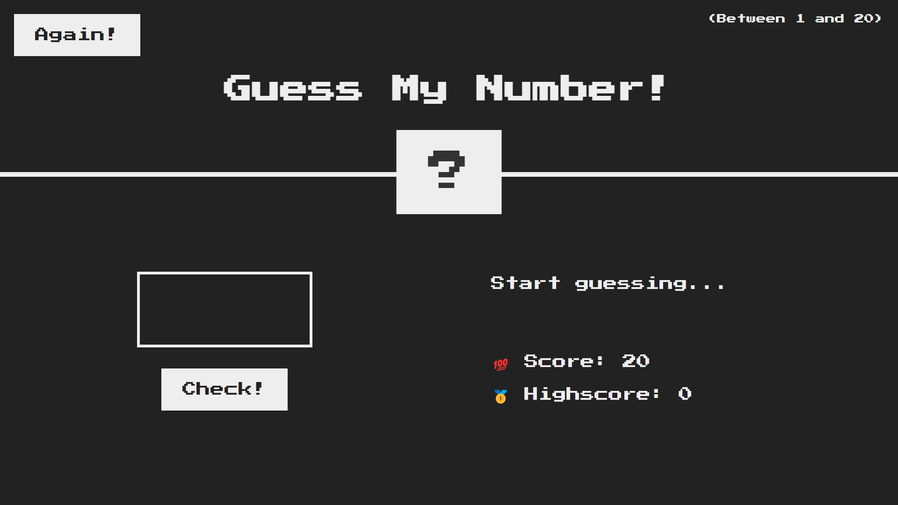
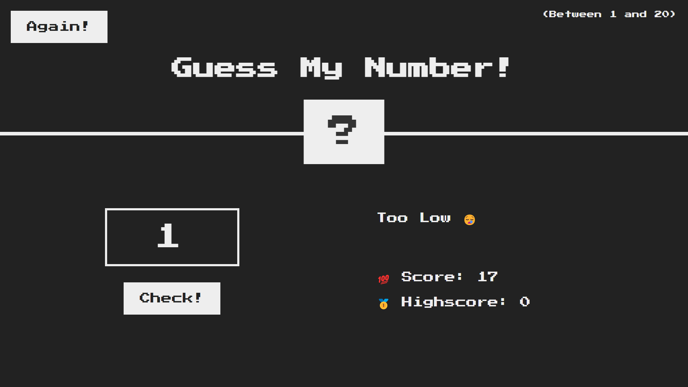
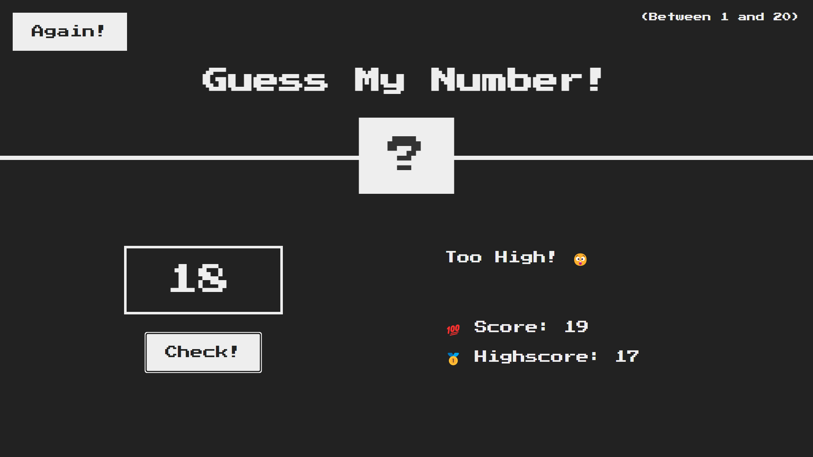

# Guess My Number

Hello Everyone 😊

This is a basic gaming project build on the foundation of **HTML**, **CSS**, **JavaScript**(beginner level project).
This project is part of my JavaScript learning course, I am very much grateful to [Jonas Schmedtmann](https://www.udemy.com/user/jonasschmedtmann/) for his style of teaching, you can also avail the [course](https://www.udemy.com/course/the-complete-javascript-course/).

I have implemented his idea but modified the code to different level(soon you will find out).
** *********************************************************************** **
About the game: When you load this in the browser, which will look like this -

<picture >
  
</picture>

A random number gets generated between 1 to 20, the player has to enter a number between 1 to 20. The score is set to 20 in the beginning, after each attempt the score reduces by 1, if the player loses all his 20 attempts then he lost the game ☹️

<picture >
  
</picture>

or the player guess the correct random number, and wins!!🤩.

<picture >
  
</picture>

This was a basic walkthorugh, there is an example below, now let's see the condtions

> ### **Condtions:**

>  ## Condition 1: If Guess value is  null, then it will thrown an error 👇🏻
<picture >
  
</picture>

> ## Condition 2: If Guess value is not integer, then it will thrown an error 👇🏻
<picture >
  
</picture>

> ## Condition 3: If Guess value is not in the given range(between 1 to 20), then it will thrown an error 👇🏻
<picture >
  
</picture>

There is a button called Again, it will reset the game but keeping the highscore intact, so that if the player wins the next game the highscore will get updated.

# Example:-

The game is launched, we are at the landing page

<picture >
  
</picture>

Player enters 18, click on Check button, oops it's Too High, Score is 19

<picture >
  
</picture>

Player again enters 15, click on Check button, still Too High!, Score is 18

<picture >
  
</picture>

Player enters 1, click on Check button, now it is Too Low,Score is 17

<picture >
  
</picture>

Player enters 2, click on Check button, Hurray!! he wins, Scored 17 and highscore set to 17 too

<picture >
  
</picture>

Player clicks on Again button, to play again

<picture >
  
</picture>

Player enters 18, click on Check button, no it's Too High, Score is 19

<picture >
  
</picture>

Player enters 16, click on Check button, That was the perfect guess!, Scored 19 and highscore is updated to 19

<picture >
  
</picture>